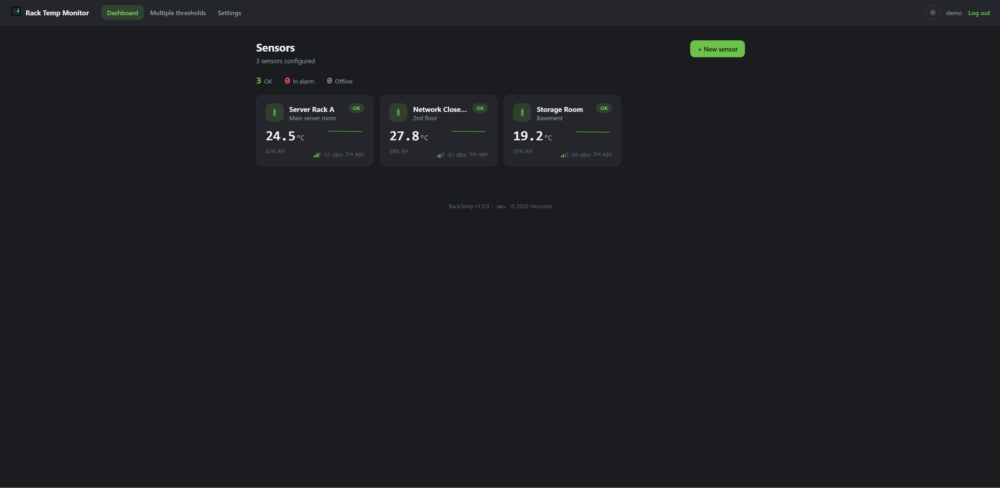
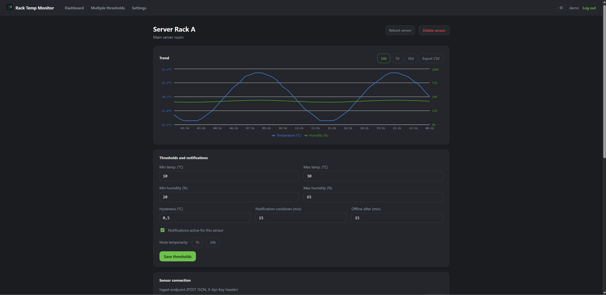

<div align="center">


# 🌡️ RackTemp
### Monitor your rack's temperature and humidity, self-hosted, from the browser.

[](./LICENSE)
[](#-quick-start-docker)
[](https://github.com/HexLions/RackTemp/pkgs/container/racktemp)
[](#-running-on-windows-without-docker)
[](#-running-on-linux-without-docker)
[](#-quick-start-docker)
[](#)

**📦 [See the Docker package →](https://github.com/HexLions/RackTemp/pkgs/container/racktemp)**

</div>

---

## 🤔 What is it?

An **ESP32-C3 Super Mini + SHT31-D** sensor sends temperature, humidity and WiFi signal
strength over the network to a backend running at your place — Docker, a native Windows
service, or a native Linux service, your choice. No cloud, no subscription: thresholds,
notifications (email/Telegram), scheduled backups, and integration with
PRTG/Prometheus/Grafana/Zabbix, all configured from the same web page.

---

## 📸 Screenshots

<p align="center">
  
  
</p>

---

## ✨ Features

**Monitoring**
- 📊 **Live dashboard** — status LEDs, sparklines, min/max thresholds with hysteresis and cooldown
- 📶 **WiFi signal strength** — 4-bar indicator + dBm reading per sensor, updated on every reading
- 📡 **Sensor discovery on the network** — an ESP32 not yet linked announces itself and shows
  up in the dashboard with a notification, no need to hunt for its IP by hand
- 🔁 **Remote sensor reboot** — one click from the sensor page, no physical access needed
  (picked up on the sensor's next check-in, no open connection required)
- 📤 **Firmware OTA updates** — upload a new `.bin` from Settings → Firmware, sensors check
  for it once a day and log when one's available. Self-flashing is off by default (see the
  note in the firmware section below) — the download is unsigned (SHA256-checked, not
  authenticity-checked) even over HTTPS, so it's opt-in

**Notifications**
- 🔔 **SMTP + Telegram** — threshold breach, sensor offline, back to normal, new sensor
  detected, each with a test button
- ✉️ **Microsoft Graph (OAuth2)** as an alternative to SMTP basic auth — for
  Outlook.com/Exchange Online mailboxes, ahead of Microsoft retiring SMTP basic auth on
  those at the end of 2026

**Account security**
- 🔐 **No exploitable default credentials** — first login forces you to choose a real
  username/password, the app stays locked until you do
- 🔑 **Two independent password-recovery paths** — an emailed code/link (SMTP or Graph),
  or an offline recovery key generated once at first login (works with no email set up at
  all, rotates on every use)
- 🛡️ **Optional two-factor authentication** — TOTP (Google Authenticator, Authy, …) on top
  of the password, set up from Settings → Account; both recovery paths above also clear it
  if you ever lose the authenticator device along with the password

**Backup & recovery**
- 💾 **On-demand + scheduled backups** — download one any time, or set an interval/retention
  and optionally have every automatic backup emailed to you
- 🆕 **First-boot restore-or-fresh choice** — a brand new install offers to restore
  sensors/settings from a `.sqlite` backup instead of starting from scratch

**Deployment**
- 🐳 **A single Docker container** — build from source or ready-made image from GHCR, data
  in a volume
- 🪟 **Native Windows service** — installer + system tray app, autostart configurable from
  the tray menu or from Settings → Account
- 🐧 **Native Linux service** — systemd unit, runs as a dedicated unprivileged user

**Integrations**
- 🔗 **Controller-level integrations** — one aggregated PRTG endpoint and one standard
  Prometheus endpoint: add a sensor and it shows up everywhere, zero per-device setup
- 🌐 **Optional static IP** — jot down each sensor's IP for reference, if you've fixed one
- ⌨️ **Rack-instrumentation-themed UI** — every number (temperatures, keys, timestamps) in
  tabular monospace, states color-coded like the real LEDs on a rack appliance

---

## 🚀 Quick start (Docker)

```
┌─────────────────────────────────────────────────────────┐
│  1. 🐳 Install Docker (Desktop on Win/Mac, Engine+Compose on Linux) │
│  2. 📥 git clone + cp .env.example .env                  │
│  3. 🔑 Set your own SESSION_SECRET in .env                │
│  4. ▶️  docker compose up -d --build                      │
│  5. 🌐 Open http://<pc-ip>:7431                            │
│  6. 👤 First login: admin/admin → choose real credentials  │
└─────────────────────────────────────────────────────────┘
```

```bash
git clone https://github.com/HexLions/RackTemp.git
cd RackTemp
cp .env.example .env
# open .env, set SESSION_SECRET=a-long-random-string
docker compose up -d --build
```

First run: downloads the base images and builds backend+frontend, a few minutes. Subsequent
ones (`docker compose up -d`) are instant.

**Check:**

```bash
docker compose ps          # should show rack-temp-monitor "Up"
docker compose logs -f      # follow the logs, Ctrl+C to exit
```

> 👤 **First login**: the app always creates an admin with default credentials `admin`/`admin`,
> but locks every other feature until you choose a real username and password (min. 8 characters).
> On a brand new install you're also offered a choice between starting fresh or restoring
> sensors/settings from a `.sqlite` backup taken elsewhere — see [Backups](#-backups-and-first-boot-restore).

See [Password recovery](#-password-recovery) for what happens if you ever get locked out.

**Management:**

```bash
docker compose down            # stops and removes the container (data stays in the volume)
docker compose up -d           # restarts without rebuilding
docker compose up -d --build   # rebuild after a git pull with code changes
docker compose down -v         # ⚠️ also removes the volume, deletes all data
```

The data (sensors, readings, thresholds) lives in the `rack-temp-data` Docker volume, persists
across restarts/rebuilds unless you use `-v`.

Readings are automatically pruned after 90 days so the DB doesn't grow forever
(thresholds and sensors are never touched). To change the window, set
`READING_RETENTION_DAYS` in `.env` (or as an environment variable in the Portainer stack).

---

## 🐳 Running with Portainer

Prefer to manage it from Portainer? Use the ready-made stack at
[`docker-compose.portainer.yml`](docker-compose.portainer.yml) — unlike the main
compose file it doesn't build from a Dockerfile (Portainer has no access to the local repo), but pulls
the ready-made image from `ghcr.io/hexlions/racktemp`. `:latest` there tracks published
[releases](https://github.com/HexLions/RackTemp/releases), not every push to `main` (that's `:edge`,
for anyone who deliberately wants bleeding-edge) — see
[`.github/workflows/docker-publish.yml`](.github/workflows/docker-publish.yml).

1. **Stacks** → **Add stack**, any name.
2. **Web editor**: paste the contents of `docker-compose.portainer.yml` (or **Upload** the file).
3. In **Environment variables** add `SESSION_SECRET` with a long, random string.
4. **Deploy the stack**.

Open `http://<pc-ip>:7431` — same behavior as the CLI deploy, including the first
`admin`/`admin` login you need to change right away.

**Automatic updates (optional)**: this stack does *not* include Watchtower by default — pulling
and restarting a container unattended, on a fixed poll, with no review step is worth choosing
deliberately rather than getting it for free. If you want it anyway, deploy
[`docker-compose.watchtower.yml`](docker-compose.watchtower.yml) as a second stack alongside this
one: as soon as a new image is out on GHCR (i.e. a new release is published), it updates and
restarts `rack-temp-monitor` within 6 hours. The data stays intact either way (it lives in the
`rack-temp-data` volume, not in the image). In **Settings → Updates** you'll still find a version
indicator with a link to the release and a button to force an immediate redeploy via an optional
Portainer webhook, whether or not Watchtower is deployed.

---

## 🪟 Running on Windows (without Docker)

No Docker/Portainer? There's a native Windows installer, same backend/frontend as this
repo: [`installer/installer.iss`](installer/installer.iss) packages a portable Node.js runtime
+ the app into a single `RackTemp-Setup-X.Y.Z.exe` that registers RackTemp as a **Windows
service** (auto-start, runs even without a logged-in user — designed for Windows Server).

1. Download `RackTemp-Setup-X.Y.Z.exe` from the [Releases](../../releases) (built automatically
   on every release, alongside the Docker image — see
   [`.github/workflows/windows-installer.yml`](.github/workflows/windows-installer.yml)).
2. Run it (requires administrator privileges). Windows SmartScreen will probably warn that
   the exe isn't signed ("Unknown publisher") — that's normal for an open-source installer without a
   paid certificate: **More info → Run anyway**.
3. At the end of installation a dedicated RackTemp window opens (not the browser) — if the
   WebView2 runtime is missing it installs it on its own on the spot (needs internet at that
   moment; on up-to-date Windows 10/11 it's already present and this step is skipped).

The **RackTemp** Windows service (nssm, auto-start, runs even without a logged-in user — designed
for Windows Server) runs the backend/API independently of the window: closing it with the
X doesn't shut anything down, it just goes to the tray (icon near the clock) — double-click to
reopen it. The tray menu (right-click the icon) has **"Exit and stop the service"** (that's the
real exit, requires UAC confirmation) and **"Start with Windows at login"**, a checkbox you can
change any time, not just during installation — the same toggle is also available from inside the
app, under **Settings → Account**, if you'd rather not dig through the tray menu. Reopening the
app after a full exit, the service starts back up on its own (another UAC prompt).

The database lives in `%ProgramData%\RackTemp\data\`, outside Program Files: reinstalling or
updating (by downloading and running a newer `Setup.exe`) doesn't touch the data or the
`SESSION_SECRET` generated at first install. The service's console output goes to
`%ProgramData%\RackTemp\service.log`, not a console window (the service has none) — the
first-login/restore setup token is in there, but the tray app also watches for it and pops up
a balloon notification with it automatically, no log-hunting needed. To build the installer
from source:

```powershell
# Requires Node.js + .NET 8 SDK + Inno Setup 6 (winget install JRSoftware.InnoSetup) on the build machine
powershell -ExecutionPolicy Bypass -File scripts\build-installer-windows.ps1
```

---

## 🐧 Running on Linux without Docker

Prefer a native service instead of a container? `racktemp-linux-x64.tar.gz` (from the
[Releases](../../releases), built automatically alongside Docker and Windows) brings along
a portable Node.js runtime and an install script that registers RackTemp as a **systemd
service**.

```bash
tar -xzf racktemp-linux-x64.tar.gz
cd racktemp-linux-x64
sudo ./install.sh
```

Creates a system user `racktemp` (not root), the `racktemp.service` service (auto-start on
boot), and keeps the database in `/var/lib/racktemp/data/` — outside `/opt/racktemp`, so it
survives reinstalls. `SESSION_SECRET` is generated once, at first install.

```bash
systemctl status racktemp     # status
journalctl -u racktemp -f     # logs
sudo ./uninstall.sh           # uninstall (asks whether to keep the data)
```

To build the package from source (requires Node.js + npm on an x86_64 Linux machine):

```bash
bash scripts/build-package-linux.sh
```

---

## 📋 How to use it

1. **Flash the ESP32-C3** (see below) — same firmware for every sensor, no
   configuration to compile in.
2. **Connect the sensor to your network**: on first boot it opens a setup access point, you
   connect to it from a phone/PC and enter the WiFi + server address from its web page.
3. **Create the sensor** from the dashboard → get a dedicated API key (you can also jot down an
   IP static, just as a reminder: the server doesn't use it to reach the sensor). If the
   device has already announced itself, it shows up in the "Sensors discovered on the network" banner — see
   [Sensor discovery](#-discovering-sensors-on-the-network).
4. **Configure the thresholds** (min/max °C, hysteresis, notification cooldown, offline timeout) on
   the sensor's page.
5. **Configure notifications** (SMTP, Graph, and/or Telegram) on Settings → Notifications, with a
   test button for each.
6. **Connect PRTG/Prometheus/other tools** from **Settings → Integrations** — once
   for all sensors, not per device.
7. **Set up account recovery** — save the recovery key shown at first login, and optionally
   turn on two-factor authentication, both from Settings → Account.

---

## 🔌 ESP32-C3 Super Mini Firmware

### Hardware

| Component | Notes |
|---|---|
| **ESP32-C3 Super Mini** | Arduino IDE board: `ESP32C3 Dev Module`. Many clones need the **CH340** USB-serial driver; if the flash doesn't start, hold **BOOT** while plugging in the USB |
| **SHT31-D** | I2C temperature/humidity sensor, address `0x44` |

### I2C wiring

| SHT31-D | ESP32-C3 Super Mini |
|---|---|
| VIN | 3V3 |
| GND | GND |
| SCL | GPIO9 |
| SDA | GPIO8 |

> The most common pinout on "Super Mini" clones — check the silkscreen on your board. The
> pins are `#define I2C_SDA_PIN` / `I2C_SCL_PIN` at the top of the sketch, if you need to change them.

### Flashing

In `firmware/rack_temp_sensor/`:

1. Install the **Adafruit SHT31 Library** and **Adafruit BusIO** libraries (Library Manager) —
   WiFi/WebServer/DNSServer/Preferences/HTTPClient/HTTPUpdate/Wire are already included in the
   esp32 core.
2. Wire the sensor as per the table above.
3. Flash the sketch **as-is**: no file to edit, no data to compile in.
   The same firmware works for every sensor you install.

The firmware sends a JSON POST to `/api/ingest` every 60 seconds (`SEND_INTERVAL_SEC` at the top
of the sketch, if you want to change it):

```json
{ "temperature": 23.4, "humidity": 41.2, "rssi": -58, "chipId": "AABBCCDDEEFF0011", "firmwareVersion": "2026-08-29.4" }
```

`chipId` is the chip's hardware identifier (used for discovery below): the firmware
includes it on its own, no need to configure it. The ingest response can also carry a one-shot
`{"reboot":true}` flag (set from the sensor's page in the dashboard), handled automatically.

Separately, once a day the sensor checks `/api/firmware/latest` for a newer version and logs
it if one's available — it does **not** flash itself automatically by default (`#define
OTA_AUTO_UPDATE 0` at the top of the sketch). If enabled, the download is checked against the
SHA256 the server reports for it (rejects a corrupted or swapped-in-transit `.bin`), but there's
still no signature/authenticity check on the file itself — no embedded public key, no code
signing — so anyone able to spoof the server address on the LAN can still serve their own `.bin`
together with a matching hash even over HTTPS. Set `OTA_AUTO_UPDATE` to `1` and reflash if you've
weighed that remaining tradeoff for your network; otherwise reflash manually over USB to update.

### 🔒 HTTPS and certificate pinning

The setup portal only asks for the server's **IP address** (and port, only if it's not the
default 7431) — no `http://`/`https://` to type. The sensor detects which one the server actually
speaks on its own the first time it connects, remembers that, and keeps re-checking it in the
background: flip the server's HTTPS toggle later (Settings → Network) and every sensor picks that
up automatically within one send cycle, no portal revisit needed. This covers all three requests
the firmware makes (`/api/discovery/announce`, `/api/firmware/latest`, `/api/ingest`), plus the
OTA `.bin` download if `OTA_AUTO_UPDATE` is on.

The server's certificate is self-signed (Settings → Network → HTTPS, generated and managed by the
app itself) — there's no public CA behind it for the sensor to validate against — so this uses
**certificate fingerprint pinning** instead of the normal CA-chain check a browser does:

- **HTTPS detected, fingerprint field left empty**: the connection is encrypted (defeats passive
  packet capture on the LAN) but not authenticated — the sensor accepts whatever certificate is
  presented, so an active on-path attacker (ARP/DNS spoofing) could still swap in their own
  certificate and see/tamper with the traffic.
- **HTTPS detected, fingerprint field filled in**: the sensor additionally checks the live
  certificate's SHA256 fingerprint against the one you pasted in and refuses to send data on a
  mismatch (logged over serial, never silently falls back to plain HTTP — a fingerprint mismatch
  is a possible-MITM signal, not "try the other scheme"). This is the recommended setup — copy
  the fingerprint from the dashboard's Settings → Network page into the setup portal's
  **"Server certificate fingerprint"** field on every sensor.

Regenerating the server's certificate (Settings → Network → Regenerate) changes its fingerprint:
every sensor pinned to the old one will refuse to send data until you update the field (hold
BOOT for 2s to reopen the portal) and re-save. Same if you point a sensor at a different server —
the fingerprint has to match that server's certificate, not the previous one.

### WiFi setup via captive portal (first boot)

On first boot — or by holding **BOOT for 2s after it's already running** to
re-enter it later (not while powering on, see the note below) — the
sensor finds no saved configuration and opens its own access point instead of
connecting to a network:

1. From a phone/PC, connect to the WiFi network **`RackTemp-XXXXXXXX`** — the password is
   the same `XXXXXXXX` suffix (the chip's ID), also printed over serial at boot.
2. A "sign in to network" popup opens on its own (Android/iOS/Windows); if it doesn't appear, open
   your browser at `http://192.168.4.1`.
3. Choose your WiFi network from the list (or type it manually) + password, the server's **IP
   address** (e.g. `192.168.1.50` — no `http://`/`https://`, add `:port` only if it's not the
   default 7431), and, if you already know it, the sensor's API key — otherwise leave it empty.
   If the server has HTTPS turned on (Settings → Network), also paste the certificate fingerprint
   shown on that same page into the **"Server certificate fingerprint"** field — the sensor
   detects HTTPS on its own, the fingerprint is what makes it *verified* HTTPS instead of just
   encrypted; see [HTTPS and certificate pinning](#-https-and-certificate-pinning) below.
4. **Save**: the sensor restarts and tries to connect. If the API key is empty, it announces itself on
   the network and you link it from the discovery banner in the dashboard (see below); if you already pasted it,
   it starts sending data right away.

The configuration stays saved on the chip (internal NVS) even after a power-cycle or a
sketch re-flash. To change it — new network, new server, new API key — power the sensor
on normally, wait for it to boot, then hold **BOOT for 2 seconds**; the WiFi network and
server address fields stay pre-filled with the current values. The WiFi password and API
key fields are left blank instead of showing the current secret — leave either one empty
to keep what's already saved, or type a new value to replace it. The portal closes on its
own after 10 minutes of inactivity (restarts the sensor, which reconnects normally if it
already had a saved configuration, or reopens the portal if it didn't).

> **Important: hold BOOT *after* it's running, never while powering it on.** On the ESP32-C3,
> GPIO9 (where BOOT usually sits on these clones — the same pin used for SCL above) is also
> the chip's own boot-strapping pin: holding it low at the exact moment of power-on/reset makes
> the ROM bootloader enter UART download mode instead of starting this sketch, so the portal
> never gets a chance to open — that's the #1 cause of "I held BOOT and nothing happened".
> If BOOT is on a different pin on your board, update `#define BOOT_BUTTON_PIN` at the top of
> the sketch.

---

## 📡 Discovering sensors on the network

No mDNS/UDP broadcast discovery: a broadcast wouldn't cross Docker's bridge network in a
typical deploy (it would need `network_mode: host`, Linux only). Instead the firmware
announces itself with a plain HTTP request to the server address entered in the
setup portal (`POST /api/discovery/announce`, right after connecting) — works with no network
changes even inside Docker/Portainer.

If the chip doesn't have a valid API key yet, it shows up in the **"Sensors discovered on the network"**
banner in the dashboard with the chip's IP and ID, plus a notification (SMTP/Graph/Telegram, if
configured) on first sighting. As soon as you create the sensor, paste its API key into the
device's setup portal (hold BOOT for 2s after boot to reopen it) and save, the entry disappears
on its own — or link an already-existing sensor to the discovered device straight from the
banner, no manual key copy-paste needed either way.

---

## 🔑 Password recovery

There is a single admin account, with two independent ways back in if you lose the password —
neither requires touching the database by hand:

| Method | Requires | Where |
|---|---|---|
| **Recovery key** | Nothing — works fully offline | Login → *Forgot password?* → *Recovery key* tab |
| **Emailed code/link** | SMTP or Graph configured under Settings → Notifications | Login → *Forgot password?* → *Email link* tab |

The recovery key is a 160-bit code shown **once**, at first login (and any time after that from
Settings → Account, which invalidates the previous one). It resets the password with no network
dependency at all, and a fresh key is issued automatically every time the old one is used, so it
stays usable going forward. If two-factor authentication was on, both recovery paths turn it off
too — so losing the authenticator app along with the password doesn't compound into a full
lockout.

Emailed resets send a plain code to paste in by default, not a clickable link — building the
link from the request's `Host` header would let it be spoofed to point somewhere else (a
password-reset-poisoning attack). Set the optional `PUBLIC_URL` environment variable (e.g.
`https://racktemp.example.lan`) to get a clickable link instead.

---

## 💾 Backups and first-boot restore

**Settings → Backup** covers both directions:

- **On-demand**: download a full `.sqlite` backup (sensors, thresholds, notifications config,
  login) any time, with one click.
- **Scheduled**: turn on automatic backups with your own interval and how many to keep (oldest
  ones get pruned), optionally emailed on every run (uses the SMTP/Graph configuration from
  Notifications).

A **brand new install** — one that still has the default `admin`/`admin` login — offers a choice
on first login: set everything up from scratch, or upload a `.sqlite` backup taken from another
RackTemp instance to restore sensors, thresholds, notification settings and the real
username/password in one step, skipping setup entirely.

---

## 🔗 Monitoring integrations

Configured **once, at the controller level**, from **Settings → Integrations** — not per
sensor: add a rack sensor and it shows up automatically everywhere.

| Tool | How |
|---|---|
| **PRTG** | A single `HTTP Data Advanced` sensor pointed at `/api/prtg/all?key=<token>` — every rack sensor becomes a `<name> - Temperature/Humidity/Age/Online` channel group. Token on the Integrations page |
| **Prometheus / Grafana** | `GET /metrics` in standard Prometheus format, add it as a scrape target |
| **Zabbix, Uptime Kuma, others** | Read the same `/metrics` with no dedicated plugins |
| **Per-sensor, as its own device** | See below — for when you want one sensor to be its own device/host in the monitoring tool, not a channel inside one aggregated sensor |

Example `prometheus.yml`:

```yaml
scrape_configs:
  - job_name: rack-temp-monitor
    static_configs:
      - targets: ["<host>:7431"]
```

Exposed metrics: `rack_temp_celsius`, `rack_temp_humidity_percent`, `rack_temp_online`,
`rack_temp_last_seen_seconds`, `rack_temp_threshold_min_celsius`, `rack_temp_threshold_max_celsius`
— all with `sensor`, `sensor_id`, `location` labels.

> `/metrics` doesn't require authentication (like `node_exporter` and most
> Prometheus endpoints): if this instance is reachable beyond your trusted LAN, put it
> behind a reverse proxy with an IP allowlist or basic auth.

### One sensor as its own device

PRTG's (and most tools') auto-discovery only understands standard protocols (SNMP, WMI, …) —
there's no way for it to auto-detect a custom JSON API like this one. Instead, each sensor's own
page (**ready-made URLs, under "This sensor as its own device"**) gives you what you need to
manually create one device per sensor, each with its own sensors/channels instead of being a
channel inside one big aggregated one:

| Tool | URL |
|---|---|
| **PRTG** | `/api/prtg/<sensorId>?key=<sensor's apiKey>` — add as an `HTTP Data Advanced` sensor on a device you create for this one rack sensor |
| **Zabbix, Uptime Kuma, Home Assistant, others** | `/api/status/<sensorId>?key=<sensor's apiKey>` — plain JSON (`temperature`, `humidity`, `rssi`, `online`, `lastSeenAt`), for any tool that has a generic "read JSON from URL" item/monitor type |

Both PRTG endpoints also include an **Online** channel/field (1/0, based on whether a reading
arrived within the sensor's configured offline timeout) with PRTG's limit already set so it
alerts on its own — no manual channel-limit setup needed, works like a ping sensor going down,
but reflects actual data flow rather than just ICMP reachability. If the sensor has a static IP
configured, you can also add PRTG's native **Ping** sensor on the same device for a network-layer
check alongside it.

The **Temperature** and **Humidity** channels carry the same min/max thresholds already
configured for that sensor on its RackTemp page, as PRTG channel limits — PRTG raises its own
alert when they're crossed, no need to set the same numbers again in PRTG's UI. Change a
threshold in RackTemp and PRTG picks it up on its next poll.

---

## ⚙️ Settings pages

Everything account/deploy-related lives under **Settings**, one page per topic:

| Page | What's there |
|---|---|
| **Account** | Change password, two-factor authentication setup, recovery key regeneration, Windows autostart toggle (Windows install only) |
| **Notifications** | SMTP/Graph and Telegram configuration, test buttons, alert history |
| **Integrations** | PRTG token, Portainer webhook |
| **Network** | HTTPS toggle (self-signed certificate, generated and managed by the app itself) |
| **Updates** | Current/latest version check, links to the release, manual Portainer redeploy |
| **Firmware** | Upload a new sensor `.bin` — sensors check for it daily, but only self-flash if built with `OTA_AUTO_UPDATE 1` (off by default) |
| **Backup** | On-demand download, scheduled automatic backups, saved backups list |

---

## 📁 Project structure

```
RackTemp/
├── backend/                        ← Express + Prisma/SQLite API
│   ├── src/routes/                 ← auth, sensors, ingest, discovery, prtg, metrics, integrations, system
│   ├── src/services/                ← notifier (SMTP/Telegram), graphMailer (Graph API),
│   │                                   thresholds/alarms, backupScheduler
│   └── prisma/schema.prisma
├── frontend/                       ← React + Vite
│   └── src/pages/
│       ├── settings/                ← Account, Notifications, Integrations, Updates, Firmware, Backup
│       ├── Login / FirstLogin / ForgotPassword / ResetPassword
│       └── Dashboard / SensorDetail / BulkThresholds
├── firmware/rack_temp_sensor/      ← ESP32-C3 Arduino sketch, WiFi setup via captive portal, OTA
├── Dockerfile                      ← multi-stage build, single image
├── docker-compose.yml               ← deploy via CLI (build from source)
├── docker-compose.portainer.yml    ← deploy via Portainer (image from GHCR)
├── docker-compose.watchtower.yml   ← optional add-on stack: auto-update via Watchtower
├── installer/installer.iss         ← Windows installer (Inno Setup)
├── windows-tray/RackTempTray/      ← WebView2 window + tray icon for the Windows install
├── linux/                           ← systemd unit + install.sh/uninstall.sh
├── scripts/build-installer-windows.ps1 ← builds + compiles the Windows installer
├── scripts/build-package-linux.sh       ← builds the native Linux package
└── .github/workflows/               ← publishes the Docker image + Windows installer + Linux package
                                        on every push/release
```

---

## 🧭 Main API

| Method | Endpoint | Auth | Description |
|---|---|---|---|
| POST | `/api/ingest` | `X-Api-Key` header | receives a reading from the sensor, may answer with `{reboot:true}` |
| GET | `/api/sensors` | session | list of sensors + latest reading |
| PUT | `/api/sensors/:id/threshold` | session | updates thresholds/mute |
| POST | `/api/sensors/:id/reboot` | session | queues a remote reboot for the sensor |
| POST | `/api/discovery/announce` | none | an ESP32 announces itself on the network |
| GET | `/api/discovery` | session | devices discovered but not yet configured |
| GET | `/api/integrations` | session | controller-level integration token |
| GET | `/api/prtg/all?key=TOKEN` | query key | all sensors in a single PRTG sensor |
| GET | `/api/status/:sensorId?key=APIKEY` | query key | plain JSON for one sensor, for Zabbix/Uptime Kuma/other tools |
| GET | `/metrics` | none | all sensors in Prometheus format |
| PUT | `/api/notifications/config` | session | configures SMTP/Graph/Telegram |
| GET/PUT | `/api/system/backup-settings` | session | scheduled backup interval/retention/email |
| POST | `/api/system/backups/run` | session | on-demand backup, optionally emailed |
| GET | `/api/firmware/latest` | none | current firmware version metadata, for sensor OTA checks |
| POST | `/api/auth/login` | none | password login, returns `{mfaRequired:true}` if 2FA is on |
| POST | `/api/auth/mfa/login` | pending-MFA session | completes login with a TOTP code |
| POST | `/api/auth/forgot-password` | none | emails a password-reset code/link |
| POST | `/api/auth/reset-password-with-key` | none | resets the password with the offline recovery key |

---

## 💻 Local development (without Docker)

```bash
# backend
cd backend
cp .env.example .env
npm install
npx prisma db push
npm run dev            # http://localhost:7431

# frontend, in another terminal
cd frontend
npm install
npm run dev             # http://localhost:5173, proxies to :7431
```

---

## 🔒 Security

Full threat model and how to report a vulnerability: **[SECURITY.md](./SECURITY.md)**. Quick
reference for exposing an instance beyond a trusted LAN:

- **Put it behind a reverse proxy terminating HTTPS**, and set `COOKIE_SECURE=1` +
  `TRUST_PROXY_HOPS` (usually `1`) in `.env` — otherwise the session cookie never gets the
  `Secure` flag and rate limiting sees the proxy's IP instead of the client's. Alternatively,
  skip the reverse proxy and turn on the built-in self-signed HTTPS from Settings → Network
  instead — that sets `Secure` on its own, no extra config needed.
- **`/metrics` and `/api/version` are public by design**, no auth — Prometheus scraping and
  update checks need to work with zero setup. Nothing sensitive is in either response.
- **PRTG/status integration keys travel in the query string** (`?key=...`), not a header — PRTG
  and most monitoring tools only support that form. That key ends up in every reverse proxy's
  access log between the monitoring tool and this app. Treat it like any other credential: don't
  point it through a proxy you don't control the logs of.
- **Optional breach-database check on new passwords** — set `HIBP_PASSWORD_CHECK=1` to reject a
  password that's appeared in a known data breach (HaveIBeenPwned, k-anonymity, off by default —
  see [SECURITY.md](./SECURITY.md#password-strength) for why).
- **Docker images are signed** (cosign, keyless via GitHub OIDC) and carry build provenance + an
  SBOM — see [SECURITY.md](./SECURITY.md#supply-chain) for the verify command.

---

## 🗺️ Roadmap

- 🐘 Migration to Postgres for multi-instance deploys (change `provider` in
  `backend/prisma/schema.prisma` + `DATABASE_URL`)
- 📶 MQTT support as an alternative to HTTP POST

---

## 🙏 Credits

Built on a great open-source foundation:

- 🔧 **[Prisma](https://www.prisma.io/)** + **[Express](https://expressjs.com/)** — backend and persistence
- ⚛️ **[React](https://react.dev/)** + **[Vite](https://vitejs.dev/)** + **[Recharts](https://recharts.org/)** — dashboard and charts
- 📟 **[Adafruit SHT31 Library](https://github.com/adafruit/Adafruit_SHT31)** — sensor driver
- 📨 **[Nodemailer](https://nodemailer.com/)** + **[node-telegram-bot-api](https://github.com/yagop/node-telegram-bot-api)** — notifications
- 🔑 **[otplib](https://github.com/yeojz/otplib)** + **[qrcode](https://github.com/soldair/node-qrcode)** — two-factor authentication
- 🐳 **Docker** + **GitHub Container Registry** — image build and distribution

---

## 📜 License

Released under the **[GNU General Public License v3.0](./LICENSE)**.

> This program is free software: you can redistribute it and/or modify it under the terms of
> the GNU General Public License as published by the Free Software Foundation, either version 3
> of the License, or (at your option) any later version.

---

<div align="center">

**Made with 💚 by [HexLions](https://github.com/HexLions)**

*If this project is useful to you, leave a ⭐ on the repo!*

</div>
